# Welcome with Photos

Unlock the power of your existing CCTV infrastructure for actionable insights.  
The global video analytics market is projected to reach **£20B by 2028**.  
Reduce operational costs and enhance safety across all industries.  
Over **85% of organisations with CCTV** lack actionable insights from video data.

---

## Contents

1. [Introduction](#introduction)  
2. [Pretrained Models](#pretrained-models)  
   - [Heatmap Counting](#heatmap-counting)  
   - [Speed Estimation](#speed-estimation)  
   - [Danger Zone Detection](#danger-zone-detection)  
   - [Object Counting](#object-counting)  
   - [Fall Detection](#fall-detection)  
   - [Fire Detection](#fire-detection)  
   - [Helmet and Safety Vest Detection](#helmet-and-safety-vest-detection)  
   - [Segmentation](#segmentation)  
   - [Analytics Model](#analytics-model)  
3. [Custom Models](#custom-trained-models)  
4. [Dashboard](#dashboard)

---

## Introduction

**VisionX - SSI AI-powered video analytics solution** revolutionizes operational intelligence by transforming live CCTV footage into actionable insights.

Built to be used across industries, the platform ensures compliance, boosts safety, and improves overall efficiency through real-time analysis.  
By leveraging edge computing, the solution eliminates the need for constant manual supervision. It continuously monitors key operational parameters, detects anomalies, and issues alerts when deviations occur.  
All insights are centralized in intuitive dashboards tailored for executives, site managers, and compliance officers.

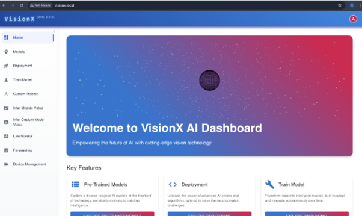

---

### Why Choose Us

- **Real-time event detection:** Flags safety violations, unauthorized access, and delayed activities.  
- **Centralized visibility:** Dashboards aggregate KPIs across multiple sites.  
- **Automated reporting:** Minimizes human dependency and ensures data accuracy.  
- **Compliance assurance:** Tracks adherence to standard operating procedures and safety norms.  
- **Data-driven decision-making:** Enables better resource planning and faster incident resolution.  

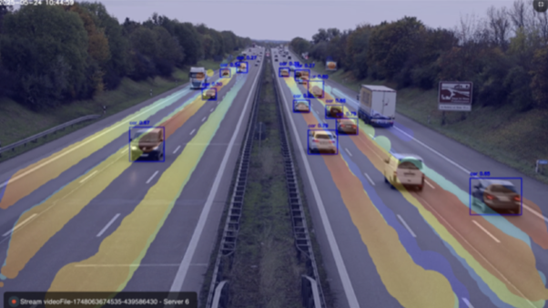

---

## Pretrained Models

### Heatmap Counting

Detects and visualizes the concentration of vehicles in specific zones using heatmap overlays.  
Ideal for monitoring vehicle density, managing traffic, and optimizing movement in real time.

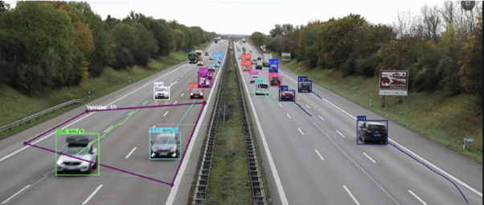

---

### Speed Estimation

Accurately calculates the speed of moving vehicles from video feeds.  
Useful for traffic monitoring, law enforcement, and road safety analysis in both urban and highway environments.

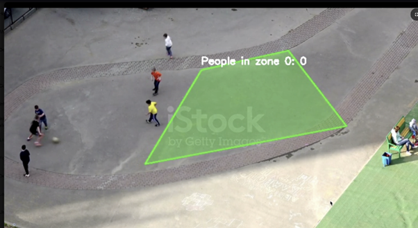

---

### Danger Zone Detection

Identifies and alerts when objects or individuals enter predefined hazardous areas.  
Crucial for industrial safety, construction zones, and automated risk prevention systems.

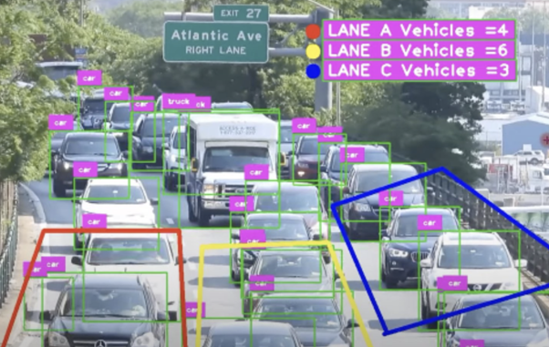

---

### Object Counting

Counts people, vehicles, or other moving objects in a scene.  
Enables footfall analytics, traffic flow monitoring, and resource planning in smart city or retail scenarios.

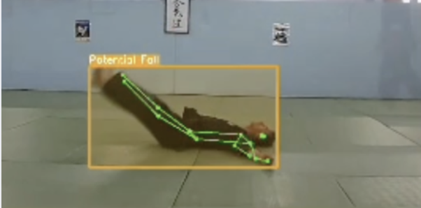

---

### Fall Detection

Detects human falls in real-time using advanced pose estimation.  
Essential for elderly care, healthcare facilities, and workplace safety monitoring.

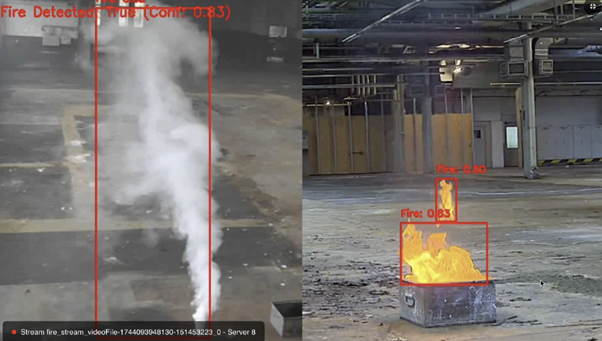

---

### Fire Detection

Recognizes early signs of fire through visual cues in surveillance feeds.  
Provides rapid alerts to reduce response time and mitigate potential damage in indoor or outdoor environments.

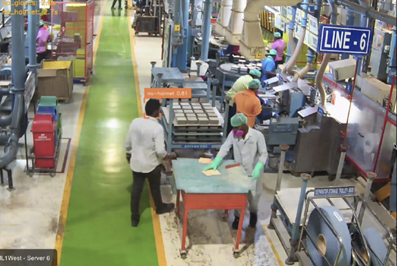

---

### Helmet and Safety Vest Detection

Ensures compliance with PPE standards by identifying helmets and safety vests.  
Enhances worker safety in construction, mining, and industrial environments.

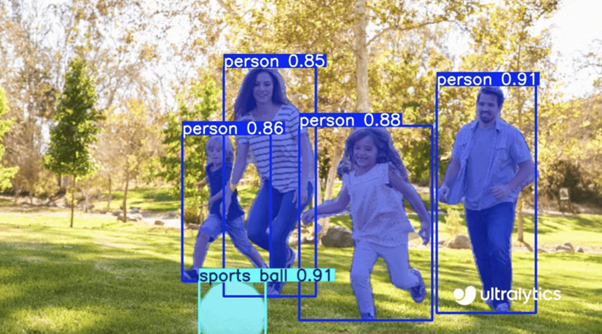

---

### Segmentation

Performs pixel-level image segmentation to distinguish between objects and backgrounds.  
Supports complex vision tasks like object isolation, defect detection, and material classification.

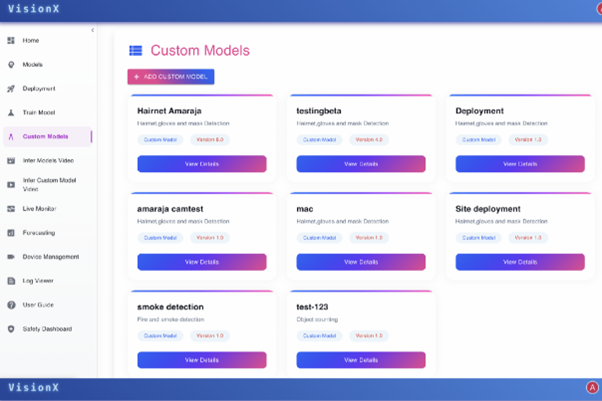

---

### Analytics Model

Processes and studies surveillance or sensor feed data to derive actionable insights.  
Supports anomaly detection, behavioral analysis, and custom analytics workflows for advanced operational intelligence.

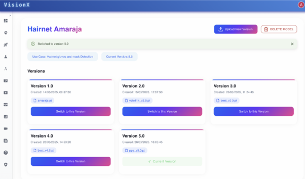

---

## Custom-Trained Models

Users can train models using their own datasets to meet unique business needs.  
This allows for fine-tuning accuracy, handling niche scenarios, and adapting to specialized environments — ensuring the AI model aligns precisely with operational goals and context.

Custom training is faster and more efficient when aligned with our existing pretrained models, requiring only minor modifications.  
This ensures higher accuracy, adaptability to unique environments, and better performance on niche tasks — empowering smarter, more relevant, and scalable AI solutions.

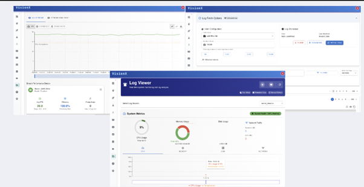

---

### Version Control of Custom Models

VisionX provides robust version control for custom-trained models, allowing users to:

- Track changes  
- Compare performance across versions  
- Roll back to previous iterations if needed  

This ensures model reliability, continuous improvement, and safe experimentation — empowering teams to manage AI development with confidence, transparency, and full control over their training workflows.

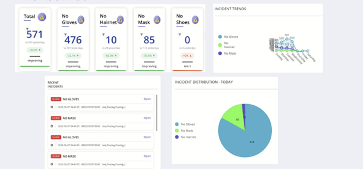

---

## Dashboard

*(Content placeholder for dashboard details.)*

---
